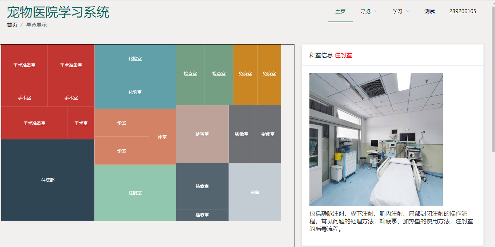

# 宠物医院部署指南

## 项目介绍

该项目用于导师教学，相关代码并非本人所写，相关人员已毕业，本人只是进行托管保存，可能会交由其他人员维护。考虑到今后本人不会维护，故写了相关的部署指南，方便接手人员使用，仅对部署部分代码稍作研究，很多处理并非最优处理。

## 文件结构

ffpet：Vue前端

pet.war：后端

petService.sql：数据库生成

此外，图片素材需要百度云下载([img](https://pan.baidu.com/s/1k-jdtlOwnrLBgoC9XfNL3w)，密码：4adr)

## 环境介绍

腾讯云+Ubuntu16.04

腾讯云可以申请校园扶持计划，详见[云+校园扶持计划](https://cloud.tencent.com/act/campus)。远程连接可以使用Putty。

## 安装步骤

### 环境配置

使用Oneinstacak一键安装 tomcat、 mysql 5.7（密码：123456），参考[OneinStack安装](https://oneinstack.com/install/)。

注意：mysql8.0和5.7不同之处很多，这里使用5.7

### 项目部署

将本地文件手动部署到服务器端，包括ffpet、pet.war、img，OneinStack相关部署可以参考[OneinStack如何部署JAVA应用](https://oneinstack.com/question/how-to-deploy-java-application/)。应该有高端自动部署工具，这里简单使用工具Putty上传文件，使用方法：

在window机上进入ptty安装目录，如

```
cd C:\Program Files\PuTTY
```

使用pscp进行文件或者文件夹的上传或下载，输入pscp查看具体用法，以下举例说明：

```
 pscp -r 本地文件 用户名@IP:云端文件
```

注意：往往不能直接上传到无权限的目录下，故可以先传到有权限处，再进行移动。不过也肯定有其他方法。

### 数据库生成

启动mysql 5.7，可以远程连接数据库，也可以将sql文件上传到云端执行。

注意：sql语句将图片的路径保存起来，云服务器ip不同，保存的地址也不同，此外，需要考虑图片名包含中文。

## 效果图



